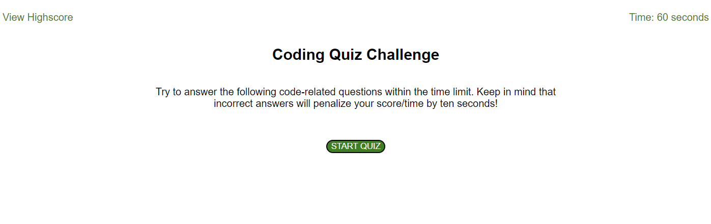

# week4-coding-quiz

## Description

Provide a short description explaining the what, why, and how of your project. Use the following questions as a guide:

I wanted to test my knowledge on week 4's content by applying dynamic javascript to create, append, and style elements in this program. I built this test to continue my knowledge of JavaScript and build upon these questions as I move through this course. This project came with many challenges to overcome. It is still very much a work in progress and contains several bugs that have yet to be worked out. I feel very proud of this project as it was the first so far in this course that presented a very challenging code structure and through perseverance I was able to meet the minimal viable product requirements.

## Homepage Screenshot

## License

Please refer to the license found in the github repository.

## Link to Live Deployment

https://jstanion.github.io/week4-coding-quiz/

## Code Source

I did receive guidance from my TA (Zack) on retrieving data from local storage for the high scores list. We were able to work through the problem together to create a function that would pull data and create an ordered list of player scores.